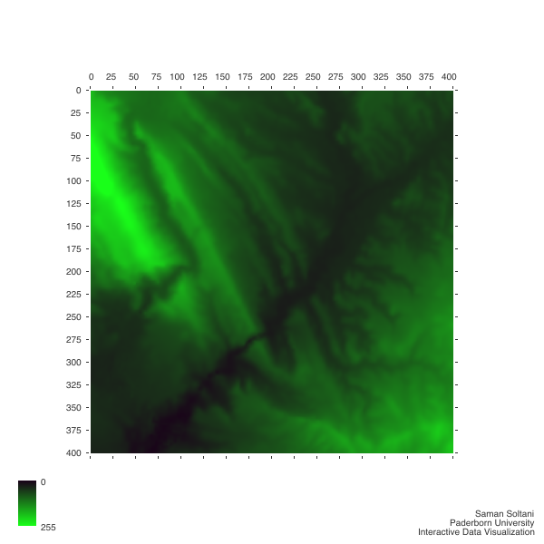

# Interactive Data Visualization
This repo is contain the self-test of the [Interactive Data Visualization](https://cs.uni-paderborn.de/en/cgvb/courses/summer-term-2018/interactive-data-visualization/) course in Paderborn University and other assignments. Also, this is an application for “Current Topics in Visualization” seminar and it shows a visualized image of [Colorado Elevation](http://www.idvbook.com/teaching-aid/data-sets/the-colorado-elevation-data-set/) developed in [Node.js](https://nodejs.org) with [Canvas HTML API](https://developer.mozilla.org/kab/docs/Web/API/Canvas_API). 

## Installation
Please install packages like this:
```
npm install
```

## Run project
You can run project in this way:
```
npm start
```
### Output
The output should show up in same folder as `image.png`

## Demo


## Assignments
You can find other assignments in related folder.
