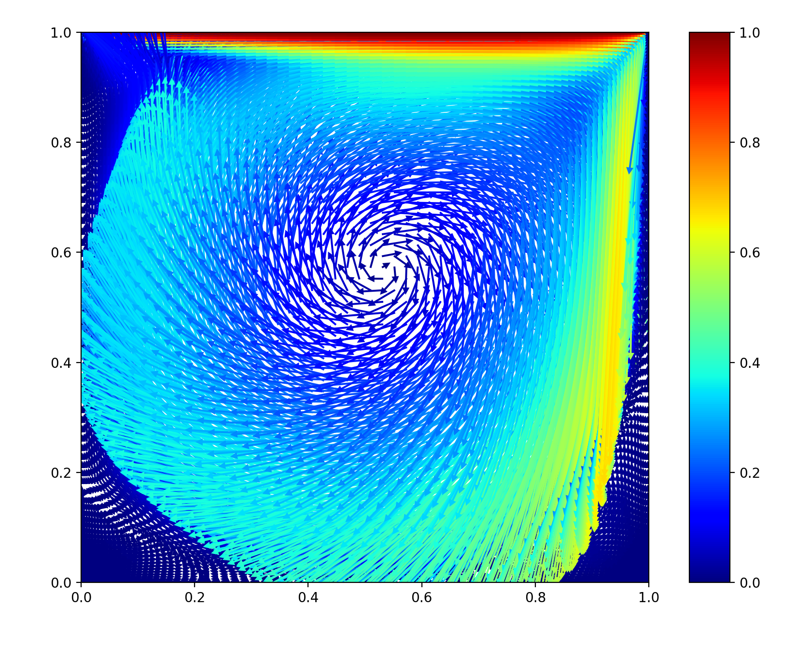

# Interactive Data Visualization
## Assignment 1
This folder is contain first assignment of the [Interactive Data Visualization](https://cs.uni-paderborn.de/en/cgvb/courses/summer-term-2018/interactive-data-visualization/) course in Paderborn University. 

You can read about Flow Data's the tasks in [assignment file](./Assignment1.pdf).

Solution contains two programming languages, Node.js and Python.

## Node.js
### Installation
Please install packages like this:
```
npm install
```

### Run project
You can run project in this way:
```
npm run as1
```
### Output
The output should show up in same folder as `image.png`

### Demo


## Python
This code is tested on Python 2.7.

### Installation
Please install needed packages like this:
```
pip install pandas
pip install matplotlib
```

### Run project
You can run project in this way:
```
python main.py
```
### Output
The output should show up as a window.

### Demo

